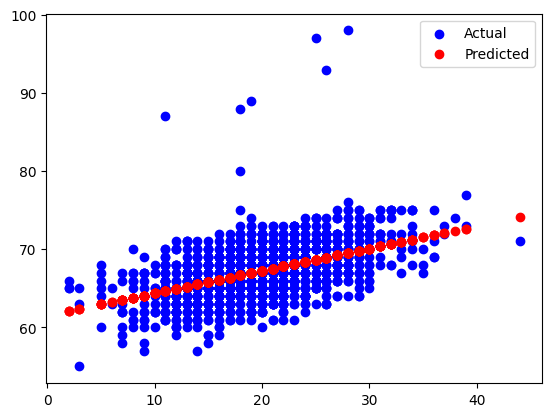

# Student Score Prediction

## Overview  
This project builds a linear regression model to predict students' exam scores based on their study hours and other factors. The goal is to understand how study behaviors influence academic success.

## Project Visualizations

### Study Hours vs Exam Scores

### Regression Model Predictions

### Model Evaluation Metrics

## Dataset  
Student Performance Factors dataset from Kaggle with features like hours studied, attendance, and parental involvement.

## Methodology  
- Data cleaning and exploration  
- Visualizing study hours vs. scores  
- Splitting into train/test sets  
- Training a linear regression model  
- Evaluating with mean absolute error and R²  
- Visualizing results  

## How to Run  
1. Install dependencies: `pip install pandas matplotlib scikit-learn`  
2. Run `student_score_prediction.py` or notebook with dataset in the same folder  

## Results  
The model accurately estimates final scores with low error, demonstrating a strong correlation between study time and exam performance.
